# Track 4 — Database & Schema Analysis

ABC Kids HR & Payroll app — Supabase Postgres (project `cgsidolrauzsowqlllsz`, PRODUCTION).
Read-only audit. Live DB inspected via Supabase MCP; cross-checked against repo SQL.

---

## Source & method (live MCP vs repo SQL; any drift)

**Method.** All schema facts below are OBSERVED from the live production DB via Supabase MCP:
- `list_tables(public, verbose)` — 28 base tables + columns + PK + FK.
- `execute_sql` SELECT-only against `pg_policies`, `pg_proc`, `pg_indexes`, `pg_constraint`, `pg_class` (relrowsecurity/relforcerowsecurity), `information_schema.triggers`, `information_schema.columns`, `pg_type`/`pg_enum`, `information_schema.views`, and the `companies` data rows.
- `list_extensions`.
- `get_advisors(security)` and `get_advisors(performance)`.

Repo cross-check: `schema/schema.sql`, the 50+ dated files in `schema/migrations/`, `docs/AUTH_RLS_DESIGN.md`, `docs/employer-client-model.md`, and grep of `app/index.html`, `portal/index.html`, `supabase/functions/*`.

**DRIFT — `schema/schema.sql` is materially stale (do not treat as ground truth).** OBSERVED:
- `schema/schema.sql` contains only **12** `CREATE TABLE` statements (lines 36–426: companies, workers, worker_companies, rates, pay_periods, time_entries, payments, documents, audit_log, api_tokens, admin_users, admin_companies). The live DB has **28** tables. Missing from `schema.sql`: `service_sessions`, `invoices`, `invoice_lines`, `hubstaff_projects`, `worker_tools`, `mood_checkins`, `announcements`, `portal_settings`, `contractor_logins`, `onboarding_progress`, `onboarding_signatures`, `onboarding_agreements`, `onboarding_reminders`, `portal_notifications`, `agreement_templates`, `pending_admins`, `app_secrets`.
- `contract_type` enum: `schema/schema.sql:27` defines `enum ('FT','PT')`; the **live** enum is `{FT,PT,PH,PS,PHS}` (added by `2026-06-20_contract_type_phs.sql` and earlier). `worker_companies.contract` default `'FT'`.
- `schema.sql` DOES include the recent `api_payouts_enabled` (line 48) and payments `funded_at`/`funded_by`/`fund_error` (lines 232–239), so it has been partially hand-patched — making it an unreliable, inconsistent mirror.

**Conclusion:** the live DB + the dated migration files are the reliable ground truth. `schema/schema.sql` should be regenerated (e.g. `pg_dump --schema-only`) or deleted; relying on it will cause incorrect assumptions. This is itself a finding (see Smells).

---

## Table inventory (table: columns/types/PK; key FKs)

28 base tables, 1 view. PK and notable columns/types listed; full column lists abbreviated where long. All tables have `rls_enabled=true` (see RLS section). Row counts as of audit (OBSERVED via `list_tables`).

### Core HR / payroll

- **companies** (rows 4) — PK `id uuid`. `name text UNIQUE`, `status company_status`, `kind text` CHECK `kind IN ('employer','client')` default `'client'`, `hubstaff_org_id int8`, `address/phone/website text`, `contacts jsonb '[]'`, `tax_id text`, `api_payouts_enabled bool`. Referenced by 11 FKs (rates, worker_companies, audit_log, documents, admin_companies, hubstaff_projects, invoices, service_sessions, payments, time_entries, pay_periods).
  - DATA (OBSERVED): exactly one `kind='employer'` = `Aaron Anderson E.H.S. LLC` (`id=11111111-1111-1111-1111-111111111111`, `hubstaff_org_id=258598`); three `kind='client'` (1 World Realty, 123 Baby Talks, Ability Builders for Children). Confirms the employer/client model in `docs/employer-client-model.md`.
- **workers** (52) — PK `id uuid`. Identity + heavy PII: `first/middle/last_name`, `match_key text GENERATED` (`lower(first)||' '||lower(last)`), `status worker_status`, `email/mobile/ph_address`, `date_of_birth date`, `hire_date`, `payout_method payout_method`, `payout_account jsonb`, `gcash/paymaya/paypal text`, `wise_recipients jsonb`, `wise_recipient_id int8`, `wise_recipient_uuid text`, `wise_tag`, `photo_url`, emergency contact fields, `permanent_address/postal_code/marital_status/education_level/course/school`, `profile_extras jsonb`, `work_email/work_number/work_extension`, `shift_start/shift_end time`, `created_by uuid default auth.uid()`. Referenced by 15 FKs.
- **worker_companies** (76) — junction. PK `id uuid`; UNIQUE `(worker_id, company_id)`. FK→workers, FK→companies. `role text`, `contract contract_type default 'FT'`, `hubstaff_name`, `status worker_status`, `started_on/ended_on date`, `hubstaff_user_id int8`, `bill_rate_usd numeric` (client bill rate), `weekly_hours numeric`, `session_rate_usd numeric`, `pay_basis text`. Partial UNIQUE `(company_id, hubstaff_user_id) WHERE hubstaff_user_id IS NOT NULL` (ID-first matching).
- **rates** (74) — PK `id uuid`. FK→workers, FK→companies. `amount_php numeric`, `period_basis text default 'semi_monthly'`, `effective_start date`, `effective_end date`, `note`. CHECK `effective_end IS NULL OR effective_end >= effective_start`.
- **pay_periods** (53) — PK `id uuid`; UNIQUE `(company_id, period_start, period_end)`. FK→companies. `pay_date date`, `state pay_period_state {open,locked,paid}`, `expected_hours_ft default 80`, `expected_hours_pt default 40`, `locked_at`. CHECK `period_end >= period_start`.
- **time_entries** (10,772) — PK `id uuid`; UNIQUE `(company_id, source_name, work_date)`. FK→companies (NOT NULL), FK→workers (**nullable**), FK→pay_periods (nullable). `source_name text`, `work_date date`, `tracked_seconds int default 0`, `pto_seconds int default 0`, `project text`, `activity_pct numeric`, `approval approval_status`, `approved_by/approved_at`, `import_batch_id uuid`.
- **payments** (1,086) — PK `id uuid`; UNIQUE `(pay_period_id, worker_id)`. FK→workers/pay_periods/companies (all NOT NULL). Money columns: `expected_hours, worked_hours, performance_ratio, rate_php, gross_php, health_allowance_php, thirteenth_month_php, pdd_lunch_php, bonus_php, deduction_php, net_php, original_net_php, fx_rate, payout_currency default 'USD', payout_amount`, `payout_method`, `wise_transfer_id text`, `status payment_status {draft,queued,sent,failed,reconciled}`, `paid_at`, `wise_dates jsonb`, `wise_locked_at timestamptz` (the hard-lock flag), `misc_items jsonb '[]'` CHECK `jsonb_typeof='array'`, `funded_at/funded_by/fund_error` (API-payout), `contract text`, `pay_basis text`, `units numeric`. BEFORE-UPDATE trigger `trg_payments_lock_enforce` (see Triggers).

### Invoicing (G4)

- **invoices** (1) — PK `id uuid`. FK→companies. `period_start/end date`, `pay_date`, `invoice_no text`, `status text default 'draft'`, `subtotal_usd/total_usd/markup_pct numeric`, `currency default 'USD'`, `notes`, `created_by`. Partial UNIQUE `invoices_one_live_per_period (company_id, period_start, period_end) WHERE status <> 'void'`.
- **invoice_lines** (3) — PK `id uuid`. FK→invoices (NOT NULL), FK→workers (**nullable**). `worker_name text` (snapshot), `position text`, `worked_hours`, `bill_rate_usd`, `amount_usd`, `kind text` CHECK `IN ('hourly','session')`, `sessions_count int`, `session_rate_usd numeric`.
- **service_sessions** (0) — PK `id uuid`. FK→companies (NOT NULL), FK→workers (**nullable**). `session_date date`, `session_type text`, `units int default 1` CHECK `units>=0`, `case_ref/notes/child_initials/eiid text`, `approval approval_status`, `approved_by/at`, `import_batch_id`, `external_ref text`, `created_by default auth.uid()`. Partial UNIQUE `(company_id, external_ref) WHERE external_ref IS NOT NULL`.

### Integration / config / secrets

- **hubstaff_projects** (11) — PK `hubstaff_project_id int8`. FK→companies (project→client map; `2026-06-09_hubstaff_project_client_map.sql`). `name`, `org_id int8`, timestamps.
- **api_tokens** (1) — PK `provider text`. `refresh_token`, `access_token`, `access_expires_at`. Used by `hubstaff-sync` edge fn. **RLS enabled, no policy** (intentional: edge-fn/service-role only).
- **app_secrets** (5) — PK `key text`. `value text`. Used by 5 edge fns (wise-payouts, hubstaff-sync, portal-admin, documents-expiry-check, hiring-docs-review-check). **RLS enabled, no policy** (intentional: service-role only).
- **portal_settings** (1) — PK `id int4` CHECK `id=1` (singleton). `editable_fields jsonb`, `onboarding_config jsonb` (large blob: documents/agreements/profile_tabs/onboarding_enabled).

### Auth / admin scoping (G7, G9)

- **admin_users** (3) — PK `user_id uuid`→auth.users. `email text UNIQUE`, `role text` CHECK `IN ('owner','admin')` default `'admin'`, `added_by`→auth.users, `name`, `can_countersign bool`. AFTER-UPDATE/DELETE trigger guards last owner.
- **admin_companies** (4) — PK `(admin_email, company_id)`. FK→companies. `added_by`. Per-admin company scoping (`2026-06-06_admin_company_scoping.sql`). Keyed by **email text**, not user_id (see Smells).
- **contractor_logins** (10) — PK `worker_id`. FK→workers, FK `auth_user_id`→auth.users UNIQUE. `email`, `status text default 'active'`, `last_login_at`. Maps Supabase auth user → worker (drives `my_worker_id()`).
- **pending_admins** (0) — PK `email`. `role` CHECK, `added_by`. Pre-provisioned admins bound on first sign-in by `bind_pending_admin()` trigger on auth.users.

### Onboarding (G5)

- **onboarding_progress** (10) — PK `worker_id`. `current_stage onboarding_stage`, `stage1_last_kind agreement_kind`, `stage2_last_tab`, `stage1/2/3_complete bool`, `name_mismatch_flag`, `stalled`, `started_at/completed_at/updated_at`, `extra_documents jsonb`. `completed_at` drives `is_onboarded()`.
- **onboarding_signatures** (18) — PK `id`; UNIQUE `(worker_id, agreement_kind, doc_version)`. FK→workers. `doc_sha256`, `signed_legal_name`, `signature_method {typed,drawn}`, `signature_data text` (base64 image / typed name — **stored-XSS vector into admin Print, per security memo**), `scrolled_to_end bool`, `ip_address inet`, `user_agent text`, `device_fingerprint text`, `status signature_status {signed,superseded,disputed}`, `signed_at/signed_date`.
- **onboarding_agreements** (21) — PK `(worker_id, agreement_kind)`. FK→workers. Countersign data: `f_rate, f_start_date, f_position, f_company_name, f_employment_type, f_schedule, f_hours_per_week`, `prepared_by/at`, `countersigner_user_id`, `countersigned_by/name/method/data/at`, `countersign_ip text`, `addendum_type/text`.
- **agreement_templates** (4) — PK `kind agreement_kind`. `title`, `version default '1.0'`, `body text`, `updated_by/at`.
- **onboarding_reminders** (0) — PK `id`. FK→workers. `stage_at_send onboarding_stage`, `reminder_day int`, `channel`, `sent_at`. **RLS enabled, no policy.**

### Portal / engagement (G6)

- **portal_notifications** (0) — PK `id`. FK→workers. `kind portal_notification_kind`, `title/body`, `dismissed_at`. Partial index `WHERE dismissed_at IS NULL`.
- **mood_checkins** (11) — PK `id`. FK→workers (nullable). `mood int`, `note`, `kind text`.
- **announcements** (1) — PK `id`. `title/body/author`, `active bool`, `published_at`.
- **worker_tools** (2) — PK `worker_id`. FK→workers. `requested jsonb`, `enc text` (encrypted creds blob), `provisioned_at`, `popup_pending bool`, `acked_at`. **RLS enabled, no policy** (accessed only via SECURITY DEFINER RPCs `get_my_tools`/`set_worker_tools`/etc.).

### Audit

- **audit_log** (1,935) — PK `id`. FK→companies (nullable). `actor text`, `action text`, `entity text`, `detail jsonb`, `created_at`. Index `(company_id, created_at)`. NOT append-only (admin ALL policy allows update/delete — see RLS).

### View

- **v_payouts_by_period** — `security_invoker` (OBSERVED via `reloptions`; the `2026-05-28_fix_security_definer_view.sql` migration is applied, so the old `security_definer_view` advisor is resolved). Aggregates payments × pay_periods × companies. **0 references** in app/portal/functions (see Orphans).

---

## Relationships / ER summary

```mermaid
erDiagram
  companies ||--o{ worker_companies : "client/employer tag"
  workers   ||--o{ worker_companies : member
  companies ||--o{ rates : ""
  workers   ||--o{ rates : ""
  companies ||--o{ pay_periods : ""
  companies ||--o{ time_entries : "(NOT NULL) lands on employer"
  workers   ||--o{ time_entries : "(nullable)"
  pay_periods ||--o{ time_entries : "(nullable)"
  companies ||--o{ payments : ""
  pay_periods ||--o{ payments : ""
  workers   ||--o{ payments : ""
  companies ||--o{ invoices : ""
  invoices  ||--o{ invoice_lines : ""
  workers   ||--o{ invoice_lines : "(nullable, snapshot worker_name)"
  companies ||--o{ service_sessions : ""
  workers   ||--o{ service_sessions : "(nullable)"
  companies ||--o{ hubstaff_projects : "project->client map"
  companies ||--o{ documents : "(nullable)"
  workers   ||--o{ documents : ""
  companies ||--o{ audit_log : "(nullable)"
  companies ||--o{ admin_companies : "admin scoping"
  workers   ||--|| contractor_logins : "auth_user_id->auth.users"
  workers   ||--|| onboarding_progress : ""
  workers   ||--o{ onboarding_signatures : ""
  workers   ||--o{ onboarding_agreements : ""
  workers   ||--o{ onboarding_reminders : ""
  workers   ||--o{ portal_notifications : ""
  workers   ||--o{ mood_checkins : ""
  workers   ||--|| worker_tools : ""
  agreement_templates ||..o{ onboarding_signatures : "by agreement_kind (no FK)"
  admin_users  ||..o{ admin_companies : "by email (no FK)"
  auth_users   ||--o{ admin_users : "user_id"
  auth_users   ||--o{ contractor_logins : "auth_user_id"
  auth_users   ||--o{ documents : "reviewed_by"
```

**No-FK relationships (text/enum joins, not enforced):**
- `admin_companies.admin_email` → `admin_users.email` (text equality, lowercased; **no FK**). If an admin's email changes or row is deleted, scoping rows orphan silently.
- `pending_admins.email` → `admin_users.email` (no FK; bound by trigger).
- `onboarding_signatures.agreement_kind` / `onboarding_agreements.agreement_kind` / `portal_settings.onboarding_config.agreements[].kind` → `agreement_templates.kind` (enum + config blob, not FK).
- `hubstaff_projects.org_id` and `companies.hubstaff_org_id` → external Hubstaff IDs (no constraint linking them).

---

## Normalization & schema smells

1. **Repo `schema/schema.sql` is stale and inconsistent (HIGH).** 12 of 28 tables present; `contract_type` enum wrong (`FT,PT` vs live `FT,PT,PH,PS,PHS`). Evidence: `schema/schema.sql:27,36-426`. Misleads any developer/agent who trusts it. Regenerate from live or drop it.
2. **JSON-blob overuse.** `workers.payout_account`, `workers.wise_recipients`, `workers.profile_extras`, `companies.contacts`, `payments.wise_dates`, `payments.misc_items`, `portal_settings.onboarding_config` (entire onboarding spec), `worker_tools.requested`, `onboarding_progress.extra_documents`, `audit_log.detail`. Several encode structured, queryable data (recipients, contacts, onboarding doc requirements) as opaque jsonb. Only `payments.misc_items` has a typeof CHECK; none have `pg_jsonschema` validation though the extension is available. Recipient/payout data in a blob conflicts with the project's own "ID-first entity matching" convention — `wise_recipient_id/uuid` are promoted to columns (good) but `wise_recipients` jsonb duplicates them.
3. **Denormalized snapshot vs derived columns (mostly intentional, document it).**
   - `payments.contract`, `payments.pay_basis`, `payments.units`, `payments.original_net_php`, `payments.rate_php` snapshot worker/rate state at pay time — correct for an immutable money ledger, but no comment/constraint marks them as snapshots.
   - `invoice_lines.worker_name`, `invoice_lines.position`, `invoice_lines.bill_rate_usd`, `session_rate_usd` snapshot at invoice time (worker_id nullable so the line survives worker deletion) — reasonable.
   - `worker_companies.bill_rate_usd`/`session_rate_usd` is the *current* client bill rate (live), while `invoice_lines` holds the *snapshot* — two sources of the same concept; ensure invoicing reads the snapshot.
4. **Duplicated payout columns on `workers`.** `payout_method` + `payout_account jsonb` + separate `gcash`/`paymaya`/`paypal`/`wise_tag` text columns + `wise_recipients` jsonb + `wise_recipient_id`/`wise_recipient_uuid`. Multiple overlapping representations of "how to pay this person." Redundant and error-prone.
5. **`admin_companies` keyed by email, not `user_id`.** `admin_companies.admin_email text` instead of FK to `admin_users.user_id`. All scoping helpers (`is_company_admin`, `my_admin_company_ids`) do a `lower(email)` subquery against `admin_users` per call. Correct today but fragile: email is mutable, there is no FK/cascade, and a case/whitespace mismatch silently drops scope. Smell + a minor leak-risk (see RLS).
6. **`contract_type` enum churn (enum drift).** Grew `FT,PT` → `PH` → `PS` → `PHS` across migrations; `payments.contract`/`worker_companies.pay_basis`/`payments.pay_basis` are **free `text`**, not the enum — so the typed enum and the free-text columns coexist for the same concept.
7. **`time_entries.worker_id` nullable.** 10,772 rows; unmatched Hubstaff names land company-only with NULL worker (by design for self-healing sync), but means payroll-critical rows can exist with no worker. No partial index / check to surface the unmatched backlog.
8. **`v_payouts_by_period` view appears unused** (0 code references) — see Orphans.
9. **No `updated_at` discipline.** Some tables have `updated_at` (worker_tools, hubstaff_projects, onboarding_*), most don't, and there is no generic `moddatetime` trigger (extension available but unused). Inconsistent auditability outside `audit_log`.

---

## Missing constraints & indexes

### Missing indexes (OBSERVED — `get_advisors(performance)` `unindexed_foreign_keys`)
FK columns without a covering index (sequential-scan risk on join/delete):
- `admin_companies.company_id` (`admin_companies_company_id_fkey`)
- `admin_users.added_by`
- `documents.company_id`, `documents.reviewed_by`
- `invoice_lines.worker_id`
- `mood_checkins.worker_id`
- `payments.worker_id` ← **payments is 1,086 rows and grows every period; this FK is hot** (contractor reads filter `worker_id = my_worker_id()`).
- `pending_admins.added_by`
- `rates.company_id`

Most are tiny tables today, but `payments.worker_id` and `documents.*` are worth adding now.

### Unused indexes (candidates to drop, `unused_index` advisor)
`portal_notifications_open_idx`, `payments_unfunded_drafts`, `invoice_lines_invoice_idx`, `service_sessions_company_date_idx`, `service_sessions_worker_idx`, `service_sessions_import_batch_idx`. (Several are on 0-row new tables — "unused" simply means not yet exercised; don't drop the service_sessions/invoice ones, they back upcoming features.)

### Missing / weak constraints
- **No FK on `admin_companies.admin_email` → `admin_users.email`** and **no FK on `pending_admins.email`** (text joins; see Smell 5). Scoping integrity is unenforced.
- **`onboarding_signatures.agreement_kind` / `onboarding_agreements.agreement_kind`** have no FK to `agreement_templates.kind` (enum-only; a template can be missing for a kind that has signatures).
- **`workers.email` not UNIQUE, not NOT NULL.** Duplicate/empty contractor emails possible; `contractor_logins.email` also free text.
- **`worker_companies` has no CHECK** that `ended_on >= started_on`, and no constraint preventing a worker being tagged to >1 `employer`-kind company (the single-employer invariant is data-only, not enforced).
- **`companies` employer-uniqueness not enforced.** Nothing stops a second `kind='employer'` row, yet the whole payroll model assumes exactly one. Consider a partial UNIQUE/`EXCLUDE` `WHERE kind='employer'`.
- **`time_entries.tracked_seconds`/`pto_seconds`** no `>= 0` CHECK (`service_sessions.units` has one; time_entries doesn't).
- **`payments` money columns** have defaults `0` but no `>= 0` / sanity CHECKs; `fx_rate`, `payout_amount` nullable with no bound.
- **No NOT NULL on `payments.fx_rate`/`payout_amount`** even for `status IN ('sent','reconciled')` — a paid row can have null payout amount.
- **`rates`** has no constraint preventing overlapping `[effective_start, effective_end]` ranges per `(worker_id, company_id)` (the migrations include de-dupe scripts — `2026-05-28_dedupe_rate_history*.sql` — implying overlaps did occur). An `EXCLUDE USING gist` (btree_gist available) would prevent recurrence.

---

## Table → goal map (+ ORPHAN tables, with absence evidence)

| Table | Goal(s) | Notes |
|---|---|---|
| companies | G3, G4, G7 | employer (payroll home) + client (billing tag) |
| workers | G1, G3, G5, G6 | core identity + PII |
| worker_companies | G3, G4, G7 | junction; bill_rate/session_rate |
| rates | G1, G3 | PHP pay rate history |
| pay_periods | G3 | semi-monthly periods |
| time_entries | G2, G3 | Hubstaff hours (10,772 rows) |
| payments | G1, G3 | money ledger; wise_transfer_id/status/wise_locked_at |
| invoices / invoice_lines | G4 | client billing (per-hour + per-session) |
| service_sessions | G4, G6 | flat-fee visits; contractor-logged |
| hubstaff_projects | G2, G4 | project→client mapping |
| api_tokens | G2 | Hubstaff OAuth (edge fn) |
| app_secrets | G1, G2, G8 | edge-fn secrets store |
| documents | G5, G8 | hiring docs + expiry |
| onboarding_progress / _signatures / _agreements / agreement_templates | G5 | onboarding + e-sign |
| onboarding_reminders | G5 | reminder log (0 rows) |
| portal_notifications | G6 | portal inbox (0 rows) |
| mood_checkins | G6 | wellbeing |
| announcements | G6 | portal feed |
| worker_tools | G6 | tool/credential provisioning |
| portal_settings | G5, G6 | onboarding_config + editable_fields |
| admin_users / admin_companies / pending_admins | G7, G9 | admin auth + scoping |
| contractor_logins | G6, G9 | auth user → worker |
| audit_log | G9 | audit trail (1,935 rows) |

**ORPHAN / removal candidates (verified by grep of `app/`, `portal/`, `supabase/functions/`):**
- **`v_payouts_by_period` (view)** — TRUE ORPHAN. **0** references in `app/index.html`, `app/legacy.html`, `portal/index.html`, any `supabase/functions/*`. Only appears in `schema/migrations/`. Safe removal candidate (read-only view; no dependents).
- **`onboarding_reminders`** — 0 rows, **0** code references in app/portal/functions (only docs). Built for the reminder digest that is "blocked on Resend secrets not set" (per memory). Not orphan-for-removal yet — it's a *pending feature* table; flag as **dormant**, keep.
- **`portal_notifications`** — 0 rows, **0** code references in the three source roots (only docs). Same status: **dormant** onboarding/portal feature, not dead. Keep but confirm intent.

All other tables are referenced in at least one source file (OBSERVED via grep). `mood_checkins` → `portal/index.html`; `announcements` → app + portal; `worker_tools` → app + `portal-admin`; `api_tokens` → `hubstaff-sync`; `app_secrets` → 5 edge fns; `pending_admins` → app + `admin-manage`; `service_sessions`/`invoices`/`invoice_lines`/`hubstaff_projects` → app.

ASSUMPTION: grep over the single-file apps is sufficient because they build PostgREST query strings with literal table names; a table truly used would appear as a literal. The three dormant items have 0 literal hits, corroborating "unused in code."

---

## Tenant isolation & RLS coverage (per-table; leak paths; advisor findings)

**Good news:** RLS is **enabled on all 28 tables** (OBSERVED via `pg_class.relrowsecurity` — every row `true`). The earlier `using(true)` master-key model described in `docs/AUTH_RLS_DESIGN.md` has been replaced by scoped policies. Helper functions are all `STABLE SECURITY DEFINER SET search_path=public` (verified definitions for `is_admin, is_owner, is_company_admin, admin_can_see_worker, my_worker_id, is_onboarded, my_admin_company_ids, my_clients`).

### Company/worker-scoped tables — do they use scoped helpers (not bare `is_admin()`)?
| Table | Admin policy predicate | Verdict |
|---|---|---|
| time_entries | `is_owner() OR company_id IN my_admin_company_ids()` | SCOPED ✓ |
| payments | same | SCOPED ✓ |
| pay_periods | same | SCOPED ✓ |
| invoices / invoice_lines | `is_owner() OR company_id IN my_admin_company_ids()` (lines via EXISTS on invoices) | SCOPED ✓ |
| service_sessions | same | SCOPED ✓ |
| hubstaff_projects | same | SCOPED ✓ |
| companies | `is_company_admin(id)` | SCOPED ✓ |
| audit_log | `is_company_admin(company_id)` | SCOPED ✓ (but see audit_log NULL note) |
| rates | `is_company_admin(company_id)` | SCOPED ✓ |
| worker_companies | `is_company_admin(company_id)` | SCOPED ✓ |
| workers | `admin_can_see_worker(id) OR created_by = auth.uid()` | SCOPED ✓ (worker-scoped) |
| documents | `admin_can_see_worker(worker_id) OR is_company_admin(company_id)` | SCOPED ✓ |
| onboarding_progress / _signatures / _agreements | `admin_can_see_worker(worker_id)` | SCOPED ✓ |
| contractor_logins / mood_checkins / portal_notifications | `admin_can_see_worker(worker_id)` (+ self) | SCOPED ✓ |

This is a strong, consistent implementation of the README rule. No company/worker-scoped table uses **bare `is_admin()`** in its admin policy.

### Tables that DO use bare `is_admin()` / `true` (by design, but note)
- `agreement_templates` (admin_all `is_admin()`, read `true`), `announcements` (admin_all `is_admin()`, read `active OR is_admin()`), `portal_settings` (admin_all `is_admin()`, read `true`), `admin_users` (read `is_admin()`). These are **global config / not company-scoped**, so bare `is_admin()` is acceptable. `portal_settings`/`agreement_templates` readable by every authenticated user (incl. contractors) — intended (portal needs them) but means **any** contractor can read the full onboarding_config and agreement bodies.

### LEAK PATHS / findings
1. **No table has `FORCE ROW LEVEL SECURITY`** (OBSERVED: `relforcerowsecurity=false` on all 28). The **table owner** bypasses RLS entirely. In Supabase this is normally fine (owner ≠ the `authenticated`/`anon` roles, and `service_role` is meant to bypass), so this is **expected**, not a live leak — but it means any future SECURITY DEFINER function or owner-context path is unconstrained. Worth knowing.
2. **`workers` self-leak via `created_by`.** `workers_admin_select`/`update` allow `created_by = auth.uid()`. A contractor is never `created_by` of a worker row, and admins create workers — so an admin who creates a worker keeps access even after losing that worker's company scope. Minor over-grant; flag for review.
3. **`admin_companies` email-keyed scoping is the weakest link (INFERRED).** Because `is_company_admin`/`my_admin_company_ids` resolve the caller's email from `admin_users` then match `admin_companies.admin_email` by `lower()`, a stale/mismatched email row silently grants or denies cross-company access. There is no FK to keep them in sync. Not an active exploit, but the integrity of the entire company boundary rests on an unconstrained text equality.
4. **`audit_log.company_id` is nullable**; policy is `is_company_admin(company_id)`. `is_company_admin(NULL)` returns `is_owner()` (the `cid is not null` guard short-circuits the EXISTS), so **NULL-company audit rows are visible/writable only to owners** — acceptable, but means non-owner admins can't see company-less audit events.
5. **`pending_admins` policy targets role `public`** (not `authenticated`) with `qual is_owner()` — `is_owner()` is false for anon, so effectively owner-only; harmless but inconsistent with the rest (everything else is `to authenticated`).
6. **RLS-enabled-no-policy tables (advisor INFO):** `api_tokens`, `app_secrets`, `onboarding_reminders`, `worker_tools`. For `api_tokens`/`app_secrets`/`worker_tools` this is **intentional and correct** (deny-all to `authenticated`; reached only via service-role edge fns or SECURITY DEFINER RPCs). For `onboarding_reminders` it's likely an oversight (a worker-scoped table left with no read policy) — but it's empty and dormant, so no live exposure.
7. **`anon`/`authenticated` can EXECUTE every SECURITY DEFINER helper** (advisor `0028`/`0029`, ~13 functions incl. `is_admin`, `is_company_admin`, `admin_can_see_worker`, `set_worker_tools`, `bind_pending_admin`, `allocate_invoice_no`, `set_worker_tools`). The boolean helpers leak little (they only reveal whether *the caller* is an admin). More concerning: **`set_worker_tools(p_worker_id, p_creds)` and `set_tools_requested` are SECURITY DEFINER and callable by `anon`** via `/rest/v1/rpc/...` — if they don't internally verify the caller maps to `p_worker_id`, this is a write path into `worker_tools` (credential blob). Recommend reviewing/`REVOKE EXECUTE FROM anon` on the mutating RPCs. (Behavior of the RPC bodies is Track 5 / app territory; flagged here as a DB-surface risk.)
8. **Money mutation boundary (context, mostly Track 5):** the only writer of `payments.wise_transfer_id`/`status`/`wise_locked_at` is the `wise-payouts` edge function using `SUPABASE_SERVICE_ROLE_KEY` (bypasses RLS). The current `wise-payouts/index.ts` DOES include a caller-identity check (`GET /auth/v1/user` with the bearer at lines 285-287) — this is **newer than the 2026-06-06 security memo** that reported "ZERO caller auth." Worth re-verifying it gates *all* mutating actions, not just one. DB-side, `trg_payments_lock_enforce` (BEFORE UPDATE) blocks edits to 20 protected money columns once `wise_locked_at` is set — a solid DB-level lock. NOTE: that lock is enforced by trigger logic, not RLS, and the trigger function is the **only** DB function *without* `SECURITY DEFINER` (it doesn't need it). Lock is bypassable by a `DELETE`+re-`INSERT` (trigger is UPDATE-only) or by clearing `wise_locked_at` first (the hint even says so) — acceptable by design but means "locked" ≠ immutable.

### Performance-flavored RLS findings (advisor)
- `auth_rls_initplan` on `admin_companies.admin_companies_read_self`, `workers.workers_admin_select`/`_update`, `contractor_logins.contractor_logins_self`: these call `auth.uid()`/`current_setting()` per-row instead of `(select auth.uid())`. Cheap fix; matters as `workers`/`time_entries` grow.
- `multiple_permissive_policies`: ~18 table/role/action combos have 2 permissive policies (admin + contractor) evaluated per query (workers, payments, time_entries, documents, service_sessions, pay_periods, onboarding_*, etc.). Functionally correct (admin OR self), just slower; could be merged.

---

## PII/PHI notes

- **High-sensitivity contractor PII in `workers`:** full name, DOB, home addresses (ph_address, permanent_address, landmark, postal), mobile, emergency contact (name/relationship/mobile), education history, photo_url. 52 rows. Standard HR PII; ensure the `documents` storage bucket and `photo_url` are not public.
- **Financial PII:** `workers` payout details (gcash/paymaya/paypal/wise_tag, `wise_recipient_id/uuid`, `payout_account` jsonb), and the entire `payments` ledger (PHP amounts, fx, payout amounts, Wise transfer IDs). Mutated only via service-role edge fn; contractor RLS read is `worker_id = my_worker_id() AND is_onboarded()` — correctly self-scoped.
- **Government IDs / clearances** in `documents` (`gov_id`, `nbi_clearance`, `w8ben`, `diploma`) with `side` (front/back), `mime_type`, `storage_path`. PHI-adjacent. Contractor read policy excludes `kind='other'` and admin-reviewed metadata is gated.
- **E-signature forensic data (`onboarding_signatures`):** `ip_address inet`, `user_agent`, `device_fingerprint`, `signature_data` (drawn-signature base64). This is the per-signer evidence chain — sensitive (biometric-adjacent for drawn sigs) and, per the security memo, `signature_data` is a **stored-XSS sink** when rendered in the admin Print view (sanitize on render). Keep RLS tight (currently `my_worker_id() OR admin_can_see_worker`).
- **Service sessions** carry `child_initials`, `eiid`, `case_ref` — references to **children receiving early-intervention services** (PHI under HIPAA, hence the BAA in onboarding). Currently 0 rows, but the schema is built to hold minors' health-service data; this table deserves the strictest handling (it is correctly scoped + the `baa` agreement exists).
- **Secrets at rest in DB:** `app_secrets` (5 rows: Wise/Hubstaff/Resend tokens), `api_tokens.refresh_token/access_token`, `worker_tools.enc` (encrypted creds). RLS deny-all to authenticated (good); these rely on service-role isolation and DB-at-rest encryption. `pgsodium`/`supabase_vault` are available but `app_secrets`/`api_tokens` store plaintext text values rather than using Vault.

---

## Assumptions & absences

- **OBSERVED** facts come from live MCP queries (listed in Source & method). **INFERRED** items are labeled inline (e.g. leak-path #3, RPC write risk #7).
- ASSUMPTION: grep of `app/index.html`, `app/legacy.html`, `portal/index.html`, `supabase/functions/*` is a faithful proxy for "table used in code" because these single-file apps embed PostgREST queries with literal table names. Tables with 0 literal hits (`v_payouts_by_period`, and code-wise `onboarding_reminders`/`portal_notifications`) are treated as unused/dormant accordingly.
- ABSENT: no `partitioning`, no materialized views, no custom domains, no `EXCLUDE` constraints, no `moddatetime`/generic-`updated_at` trigger, no FK from `admin_companies`/`pending_admins` to `admin_users`, no FK from `*.agreement_kind` to `agreement_templates`, no employer-uniqueness constraint on `companies`.
- ABSENT (intentional): `FORCE ROW LEVEL SECURITY` on no table (Supabase relies on role separation + service_role bypass).
- Edge-function internals (caller auth in `wise-payouts`, RPC bodies) are summarized only for the DB boundary; full behavioral analysis belongs to the functions/security track. The current `wise-payouts` source contradicts the 2026-06-06 memo's "zero caller auth" claim (it now calls `/auth/v1/user`), so that specific memo item appears partially remediated — verify coverage of all mutating branches.
- Auth advisor also flags **leaked-password protection disabled** (HaveIBeenPwned check off) and **`pg_net` extension installed in `public` schema** (move to a dedicated schema) — minor hardening items.
- Repo `schema/schema.sql` was NOT used for any inventory claim due to the drift documented above; all table/column facts are from the live DB.
