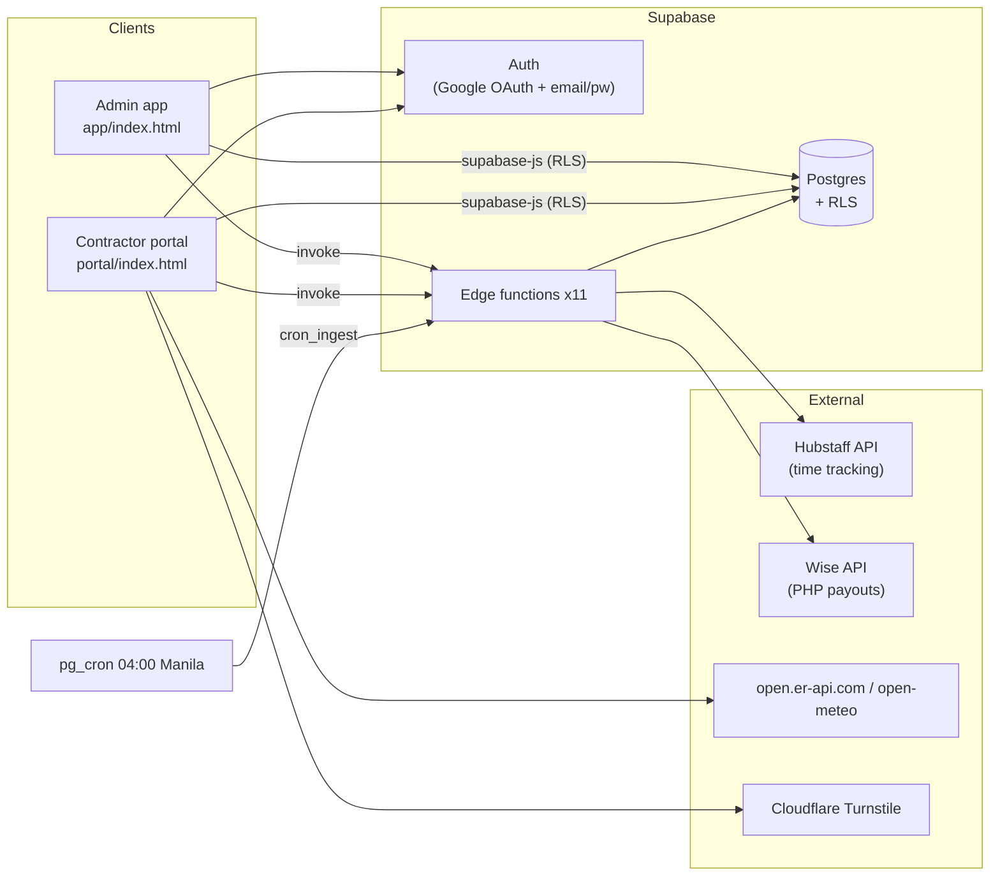
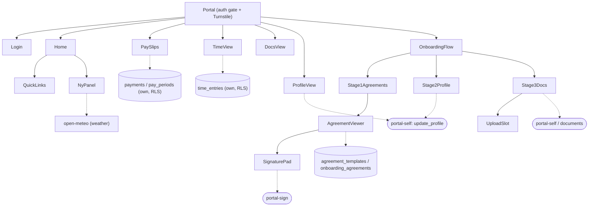

<!-- Auto-mapped from the codebase. Mermaid diagrams render in GitHub & VS Code's markdown preview. -->

# Code Map — ABC Kids HR/Payroll App

Two single-file React apps (in-browser Babel) + Supabase (Postgres/RLS + 11 Deno edge functions). No bundler. Deploy: git push → Cloudflare Workers (static assets).

- **Admin app** `app/index.html` (~11.7k lines, ~61 components) · classic fallback `app/legacy.html`
- **Contractor portal** `portal/index.html` (~1.8k lines, ~24 components)
- **Edge functions** `supabase/functions/*` · **Schema/RLS** `schema/`

---

## 1. System context

---

## 2. Admin app — tabs → components → backend

```mermaid
flowchart TD
  APP["App (tab router, lazy-mount, company switcher)"]
  APP --> OV[Overview]
  APP --> CT[Contractors]
  APP --> ONB[OnboardingAdmin]
  APP --> DOC[Documents]
  APP --> TI[TimeImport]
  APP --> PAY[Payroll]
  APP --> PROC[ProcessPayroll]
  APP --> REP[Reports]
  APP --> IMP[DeleteImports]
  APP --> AUD[AuditLog]
  APP --> CFG[Configuration]

  CT --> ProfileModal --> ExternalSourcesPanel
  CT --> PullRecipients
  ONB --> AddContractorWizard
  ONB --> AgreementsPanel --> CountersignModal
  ONB --> OnboardingDrilldown
  ONB --> AgreementTemplatesModal
  ONB --> OnboardingConfigModal
  PROC --> WisePayouts
  PROC --> WiseReconciliation
  REP --> PerContractorSummary
  REP --> ContractorHistory
  REP --> UtilizationReport
  CFG --> CompaniesModal
  CFG --> PortalSettingsModal
  CFG --> AdminsModal

  CT -.-> T_workers[("workers / worker_companies / rates")]
  ProfileModal -.->|recipients| EF_wise(["wise-payouts"])
  AddContractorWizard -.-> EF_padmin(["portal-admin: create_login"])
  AddContractorWizard -.-> T_workers
  AgreementsPanel -.-> EF_csign(["portal-countersign"])
  AgreementsPanel -.-> T_onb[("onboarding_agreements")]
  TI -.-> T_time[("time_entries / pay_periods")]
  PAY -.-> T_pay[("payments / pay_periods / rates")]
  PROC -.-> EF_wise
  PROC -.-> T_pay
  REP -.-> T_pay
  REP -.-> T_time
  DOC -.-> T_docs[("documents")]
  AUD -.-> T_audit[("audit_log")]
  CFG -.-> T_cfg[("companies / portal_settings / admin_companies / admin_users")]
  OV -.-> T_pay
```

---

## 3. Contractor portal — flow

---

## 4. Edge functions → actions → externals

| Function | Actions | Talks to |
|---|---|---|
| `wise-payouts` | batch, draft, poll, status, match, rates, recipients, get_recipient, search_contacts, find_transfers_by_recipient, profile | **Wise API**, DB (payments/workers) |
| `hubstaff-sync` | cron_ingest, activity_backfill, get_user, list_orgs | **Hubstaff API**, DB (time_entries) |
| `portal-admin` | create_login, reset_password, revoke_login, delete_contractor | Supabase Auth + DB |
| `portal-self` | update_profile, finish_onboarding | DB (own rows) |
| `portal-review` | waive, defer, needs_replacement, set_signed_date | DB (documents/signatures) |
| `portal-sign` | (sign) | DB (onboarding_signatures) |
| `portal-countersign` | (countersign) | DB (onboarding_agreements) |
| `admin-manage` | add_admin, remove_admin, set_role | Supabase Auth + admin_users |
| `documents-expiry-check` | (cron report) | DB (documents) |

---

## 5. Shared pure helpers (kept in sync across files)

- **Agreement merge engine** — `mergeAgreement` / `agAddendum` / `monthlyFromPeriod`: byte-identical across `app/index.html`, `portal/index.html`, `app/legacy.html` (enforced by the merge-drift guard in `tools/check-html-syntax.mjs`).
- **Time/TZ** — `etToPhtHHMM`, `etOffsetHours`, `periodFor`, `nextUsDstChange`, `phtParts`/`nyHourNow` (portal).
- **Names** — `fullName`, `nameTokens`, `nameKey`, `looseKey`, `normName`.
- **Data hooks** — `useQuery` (+ `pageAll` for >1000-row sets), `useSortFilter`, `useSupabase`/`useClient`, `useUnsavedGuard`, `useModalA11y`.

## 6. RLS helper functions (Postgres, SECURITY DEFINER)

`is_admin` · `is_owner` · `is_company_admin(cid)` · `admin_can_see_worker(wid)` · `my_worker_id` · `is_onboarded` · `my_admin_company_ids()` *(added for the RLS perf migration)*.
